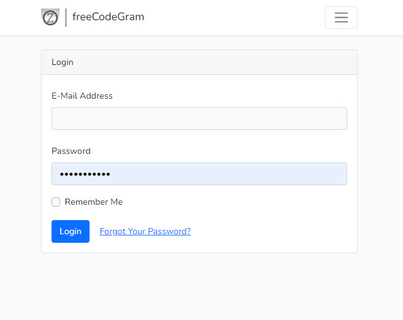
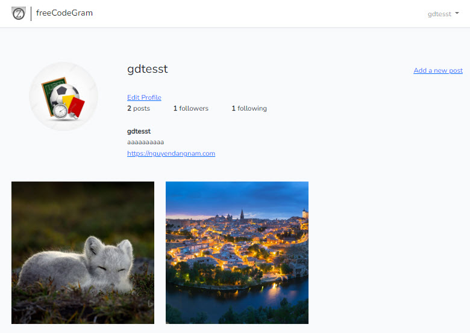
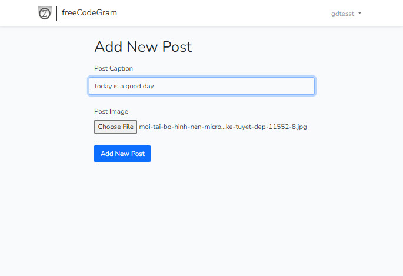
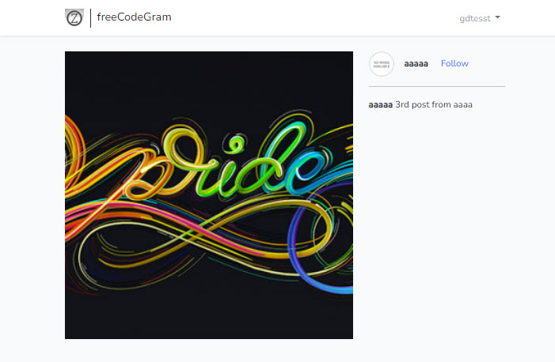

## Description

Website is the fake clone instagram using PHP/Laravel on learning.
Some function:
    - Login/Register
    - Authentication with token
    - Home page
    - User profile: change avatar, name, description, url, ...
    - Upload image and new post

## Run the SITES

    - Open terminal and run, to open and run site:
    ```php artisan serve```
    - Open another terminal and run, to run the development environment:
    ```npm run dev```

## Some image of project









## Connect to me

[https://nguyendangnam.com/](https://nguyendangnam.com/)
